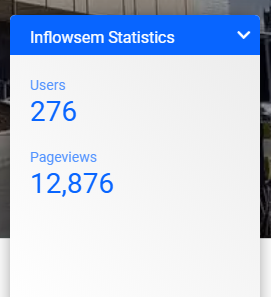

# Google Analytics widget

The homepage for the INFLOWSEM site displays a widget with some metrics. 

The widget is embeded from another Google tool called [Data Studio](https://datastudio.google.com/u/0/), and can only be directly edited from there. You should be able to edit the widget [here](https://datastudio.google.com/reporting/09af3a27-106a-4dea-bc8e-94c63d9c4035). 

The widget itself was created with the INFLOWSEM Google Analytics account, so if the above link doesn't work, you should be able to login as that and access it. 

Any edits made to it should automatically appear on the widget on the site. You shouldn't have to embed it again. 

It would have been better if the metrics could have been accessed with the [Google Analytics Reporting API](https://developers.google.com/analytics/devguides/reporting/core/v4). However, the version of PHP on asteria is too old - maybe this will work in the future.